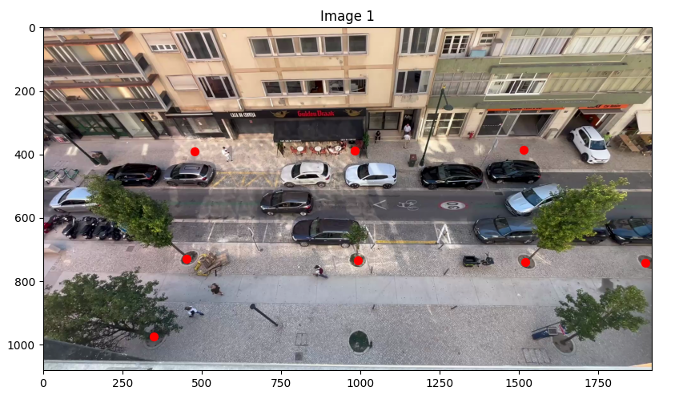
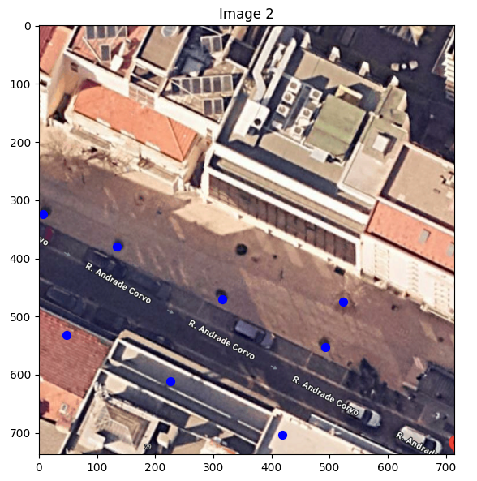
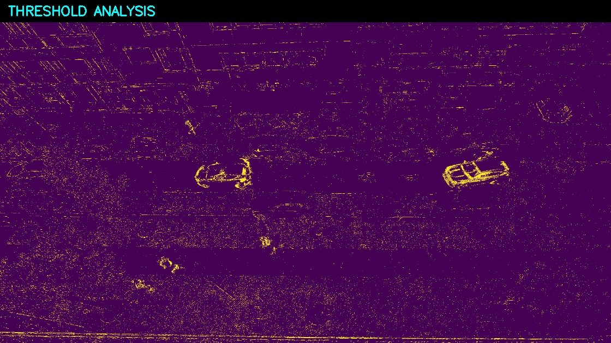
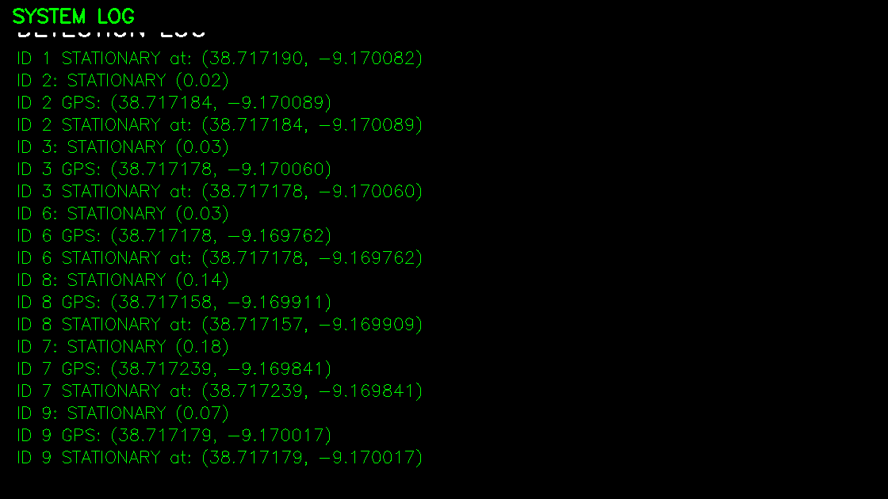

# Stationary Detector

A computer vision system for analyzing pedestrian behavior and dwell patterns in urban environments.

fiux this  overview
<div align="center">
  
  <p><em>System workflow: from video input to behavioral analytics</em></p>
</div>

## Background

This project emerged from urban analytics work conducted for BipZip Lisbon and EDP Move in Braga. The methodology focuses on analyzing mixed-use spaces where cars and pedestrians coexist - particularly around schools and transit areas - to identify where people congregate and spend the most time. There is also a need that due to RGPD we cannot store any video footage, only metadata values

The core research question was: **How to track where a public space user uses a specifc space and how to track its permanance time** Understanding these patterns enables evidence-based urban interventions, such as converting parking spaces to seating areas, installing shade structures for parents waiting for children, or redesigning pedestrian infrastructure based on actual usage patterns.

This repository contains the computer vision and analysis components. Environmental monitoring (air quality, humidity, temperature) was conducted separately and is not included here.

<div align="center">
  
  <p><em>System workflow: from video input to behavioral analytics</em></p>
</div>

## Technical Approach

The system addresses a fundamental challenge in urban analytics: **how to automatically identify when unique individuals are stationary and accurately measure the duration each person spends in specific locations.**

Due to GDPR constraints, we cannot store video footage - only metadata information. For demonstrations, we use pre-recorded content, but the production system operates on live streams without retention.

The analysis follows a sequential 6-step process:

### Step 1: Initial Calibration Setup
We obtain a satellite view of the analysis location and map the corners of the camera view to real-world GPS coordinates for spatial interpolation.

<div align="left">
  
  <p><em>GPS corner mapping for camera-to-world coordinate transformation</em></p>
</div>

<div align="right">
  
  <p><em>GPS corner mapping for camera-to-world coordinate transformation</em></p>
</div>


### Step 3: Person Detection & Tracking and settings  Background Reference Capture  
**YOLOv8 Person Detection**: Identifies individuals in pixel coordinates using a model that distinguishes between different people. If someone is occluded for extended periods, they may be counted as a new person upon reappearance.
The system ingests the first frame where no people are visible to establish a clean background reference for movement detection.

<div align="center">
  
  <p><em>YOLO bounding boxes with persistent ID tracking</em></p>
</div>

<div align="center">
  
  <p><em>YOLO bounding boxes with persistent ID tracking</em></p>
</div>

### Step 4: Movement Classification
**MOG2 Background Subtraction**: Analyzes pixel-level changes within each person's bounding box. If variation exceeds 20% threshold, the person is classified as "moving"; otherwise "stationary". Frame rate is used to calculate time duration in seconds.

<div align="left">
  
  <p><em>Background subtraction showing motion areas in white</em></p>
</div>

<div align="right">
  
  <p><em>Background subtraction showing motion areas in white</em></p>
</div>

### Step 5: Spatial & Temporal Mapping  
**Homography-based Coordinate Conversion**: Transforms pixel coordinates to real-world GPS positions. **Duration Tracking**: Accumulates time spent in stationary states per individual, maintaining historical data for pattern analysis.

<div align="center">
  
  <p><em>GPS coordinate transformation and temporal tracking</em></p>
</div>

### Step 6: Data Export & Visualization
**GeoJSON Generation**: Compiles stationary events by person ID, averaging locations where individuals spent time. Multiple stationary locations per person are tracked separately. **Heatmap Visualization**: Creates geographic heatmaps showing all accumulated dwell pattern data.

<div align="center">
  
  <p><em>Final GeoJSON output and heatmap visualization</em></p>
</div>

**Technical Implementation:**
- **Person Detection & Tracking**: YOLOv8 for detection with persistent ID tracking across video frames
- **Movement Classification**: MOG2 background subtraction analyzing pixel-level changes within bounding boxes  
- **Spatial Mapping**: Homography-based camera calibration for GPS coordinate conversion
- **Temporal Analysis**: Frame-based duration tracking with stationary event validation (6+ consecutive frames)


## Setup

1. Clone the repository:
   ```bash
   git clone https://github.com/Diogo2Analytics/StationaryDetector.git
   cd StationaryDetector
   ```

2. Create virtual environment:
   ```bash
   python3 -m venv .venv
   source .venv/bin/activate
   ```

3. Install Poetry:
   ```bash
   pip3 install poetry
   ```

4. Install dependencies:
   ```bash
   poetry install
   ```

## Running it

```bash
# Make sure virtual environment is activated
source .venv/bin/activate

# Run with the included demo video
python src/stationary_detector/main.py

Press 'q' to quit the application. Make sure to click on the video window first so it can capture the keypress.

```
## Configuration

```python
# Video & Processing Settings
DEFAULT_VIDEO_FILE = "resources/videos/2.mp4"    # Input video path
FORCE_FRAME = 4                                  # Processing frame rate, wait 4 frames before analysing
CONFIDENCE_THRESHOLD = 0.20                      # YOLO detection confidence
MOVEMENT_THRESHOLD = 0.18                        # Motion detection confidence

# Resource Paths  
SCENARIO_FILE = "resources/camera_parameters/..."     # Camera calibration
SATELLITE_IMAGE = "resources/satellite_images/..."    # Base map
GPS_CORNER_COORDINATES = [...]                        # Area boundaries

# Dashboard Layout
PANEL_WIDTH = 480                               # Dashboard panel dimensions
PANEL_HEIGHT = 360
```

## Dashboard Interface

The application provides a comprehensive real-time visualization through a 3×2 panel dashboard:

**Top Row Analysis:**
- **Original Footage**: Raw video stream for context and verification
- **Detection View**: YOLO bounding boxes with persistent person IDs and behavioral state labels
- **Movement Analysis**: MOG2 background subtraction mask showing detected motion and shadow areas

**Bottom Row Insights:**  
- **Geographic Projection**: Satellite imagery with GPS-mapped detection points showing real-world positioning
- **System Analytics**: Live log displaying detection events, movement classifications, and timing metrics
- **Threshold Visualization**: Binary movement classification output for algorithm transparency and debugging

| Original View | Detection & Tracking | Movement Analysis |
|---------------|---------------------|-------------------|
|  |  |  |

*Dashboard panels showing different analysis views of the same scene*

## Analytics Output

The system generates multiple output formats for comprehensive analysis:

### 1. Simple Analytics (`analytics.json`)
Basic duration metrics per individual:
```json
{
  "person_id_1": 45.2,    // Total stationary time in seconds
  "person_id_2": 12.8,    // Per unique tracked individual  
  "person_id_3": 67.4     // Accumulated across entire analysis period
}
```

### 2. Geographic Data (`geojson.json`)
GeoJSON format with GPS coordinates for mapping applications:
```json
{
  "type": "FeatureCollection",
  "features": [
    {
      "type": "Feature",
      "geometry": {
        "type": "Point",
        "coordinates": [-9.16995835877193, 38.717420738782415]
      },
      "properties": {
        "row_id": 0,
        "tempo_de_permanencia": 1.75,
        "id_person": 126,
        "timestamp": "2024-02-17 10:16:15.900000",
        "unique_identifier": 5260585897646893104
      }
    }
  ]
}
```

**Key Features:**
- **Stationary Validation**: Only records events after 6+ consecutive stationary frames
- **GPS Mapping**: Real-world coordinates for geographic analysis  
- **Temporal Tracking**: Precise timestamps for behavioral pattern analysis

**Real-time Console Output:**
During processing, the system provides live feedback including:
- Individual tracking status with persistent person IDs
- Movement state classification (moving/stationary) with confidence metrics
- GPS coordinate mapping for each detection event  
- Cumulative time tracking for stationary behavior patterns
- System performance metrics and processing statistics

This dual output approach enables both real-time monitoring and post-analysis review of pedestrian behavior patterns.